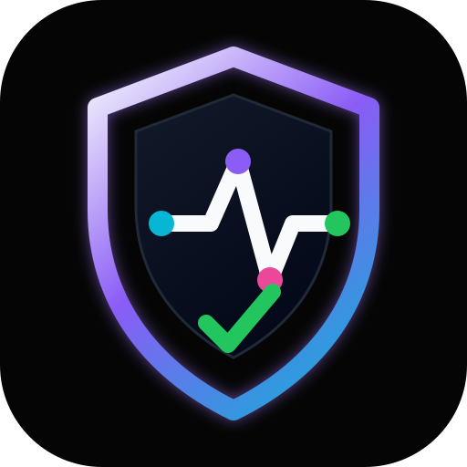
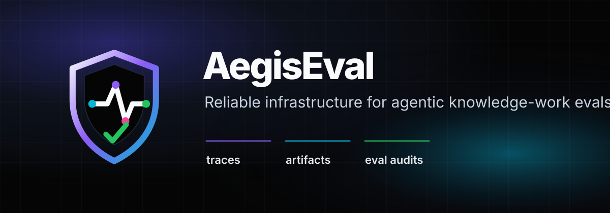

<p align="center">
  
</p>

<h1 align="center">AegisEval</h1>

<p align="center">
  Reliable infrastructure for agentic knowledge-work evals.
</p>

<p align="center">
  <a href="https://github.com/stchakwdev/aegiseval/actions/workflows/ci.yml"></a>
  
  
  
</p>

<p align="center">
  
</p>

AegisEval is a local-first Python harness for building, running, grading, replaying, and auditing realistic knowledge-work agent tasks. It is designed around one premise: an agent eval score is only useful if the task, environment, grader, trace, and final artifacts can be inspected and reproduced.

## What it does

- Defines versioned task specs for knowledge-work environments.
- Creates deterministic local workspaces per trial.
- Captures JSONL traces for lifecycle events, model calls, artifacts, and grader results.
- Grades final environment artifacts rather than trusting agent self-reports.
- Runs multi-task, multi-trial suites with flake visibility.
- Generates static HTML reports with per-trial trace drilldowns and artifact previews.
- Produces eval-quality audits with a human transcript review queue.
- Includes red-team scanners for fabricated citations and artifact spoofing.
- Supports dummy, subprocess, OpenAI-compatible, and Anthropic model adapters.

## Why this exists

Agent evals are easy to make impressive and hard to make trustworthy. A pass rate can hide brittle graders, contaminated tasks, missing controls, API failures, reward hacking, and models that merely claim success. AegisEval treats reliability infrastructure as part of the eval itself.

The harness is informed by Anthropic's public writing on agent evals, long-running agent harnesses, reward hacking, and automated auditing. See [`docs/anthropic-eval-harness-notes.md`](docs/anthropic-eval-harness-notes.md). Security boundaries are documented in [`SECURITY.md`](SECURITY.md) and [`docs/threat-model.md`](docs/threat-model.md).

## Quickstart

```bash
git clone https://github.com/stchakwdev/aegiseval.git
cd aegiseval
python3 -m venv .venv
.venv/bin/pip install -e . pytest
.venv/bin/pytest -q
```

Run one deterministic task:

```bash
.venv/bin/aegis run tasks/doc_synthesis_001 --agent dummy --out runs/doc-demo
.venv/bin/aegis replay runs/doc-demo
.venv/bin/aegis report runs/doc-demo
```

Run a full local suite:

```bash
.venv/bin/aegis suite tasks/doc_synthesis_001 tasks/data_analysis_001 \
  --trials 2 \
  --agent dummy \
  --out runs/suite-demo

.venv/bin/aegis audit-suite runs/suite-demo
.venv/bin/aegis redteam --out runs/redteam-demo
```

## Model-backed agents

Model adapters write files into the same workspace as scripted agents. The expected response shape is JSON only:

```json
{"files": [{"path": "final.md", "content": "..."}]}
```

OpenAI-compatible endpoint, including OpenAI, OpenRouter, Z.ai-compatible gateways, or local vLLM:

```bash
OPENROUTER_API_KEY=... .venv/bin/aegis run tasks/doc_synthesis_001 \
  --agent openai-compatible \
  --model z-ai/glm-5.1 \
  --base-url https://openrouter.ai/api/v1 \
  --api-key-env OPENROUTER_API_KEY \
  --out runs/openrouter-demo
```

Anthropic Messages API:

```bash
ANTHROPIC_API_KEY=... .venv/bin/aegis run tasks/doc_synthesis_001 \
  --agent anthropic \
  --model claude-sonnet-4-5 \
  --api-key-env ANTHROPIC_API_KEY \
  --out runs/anthropic-demo
```

## Overnight evals

For longer real-model runs:

```bash
PYTHONPATH=src python scripts/run_overnight_eval.py \
  --trials 25 \
  --model z-ai/glm-5.1 \
  --base-url https://openrouter.ai/api/v1 \
  --api-key-env OPENROUTER_API_KEY \
  --out runs/overnight/glm-5.1-$(date -u +%Y%m%dT%H%M%SZ)
```

See [`docs/overnight-evals.md`](docs/overnight-evals.md) for background execution, artifacts, and review checklist.

## Example report

A curated static report is included at [`examples/reports/portfolio-demo/report.html`](examples/reports/portfolio-demo/report.html). It runs five deterministic knowledge-work tasks across two trials each and includes trace drilldowns plus an eval-quality audit.

## Output artifacts

A suite run writes:

```text
runs/suite-demo/
├── suite_result.json
├── report.html
├── eval_audit.json
├── eval_audit.md
└── trials/
    └── <task_id>/trial-001/
        ├── result.json
        ├── trace.jsonl
        ├── trace.html
        └── workspace/
```

The key portfolio artifacts are `report.html`, `trace.html`, artifact previews, and `eval_audit.md`.

## Role fit

AegisEval is built to demonstrate production-grade ownership of agentic evaluation infrastructure: canonical task specs, stable runs, instrumentation, outcome grading, replayability, reliability metrics, release gates, and eval-integrity failure analysis.

## Development

```bash
python3 -m pip install -e '.[dev]'
python3 -m pytest -q
ruff check .
PYTHONPATH=src python scripts/e2e_smoke.py
python3 scripts/render_brand_assets.py
```

AegisEval ships a `py.typed` marker and keeps runtime dependencies small. `ruff` is configured for local quality checks but is intentionally not required at runtime.
